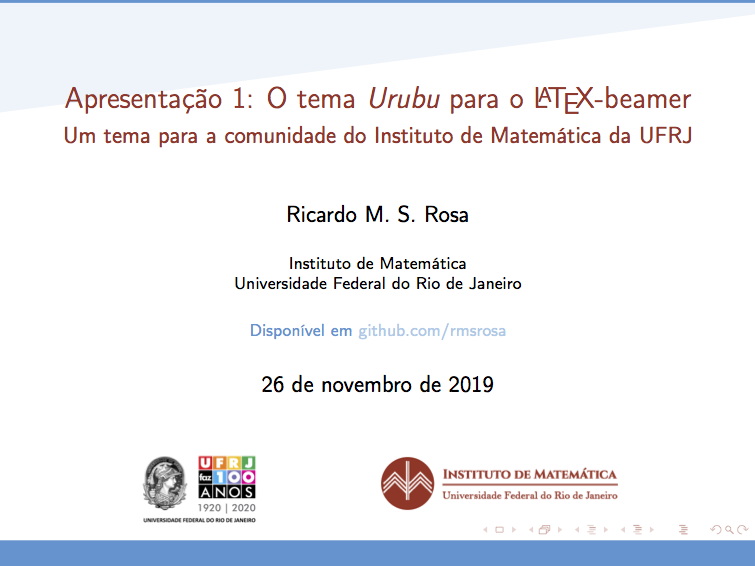
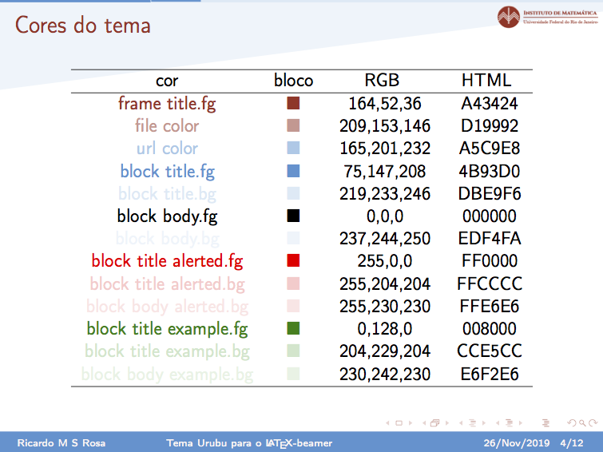
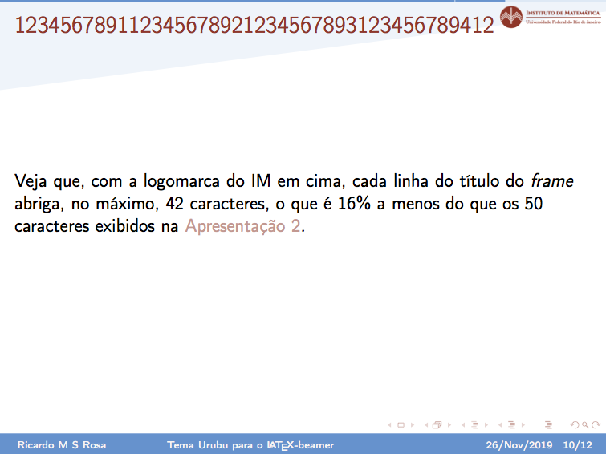
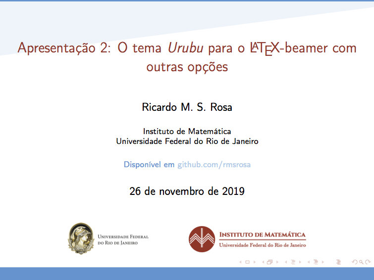
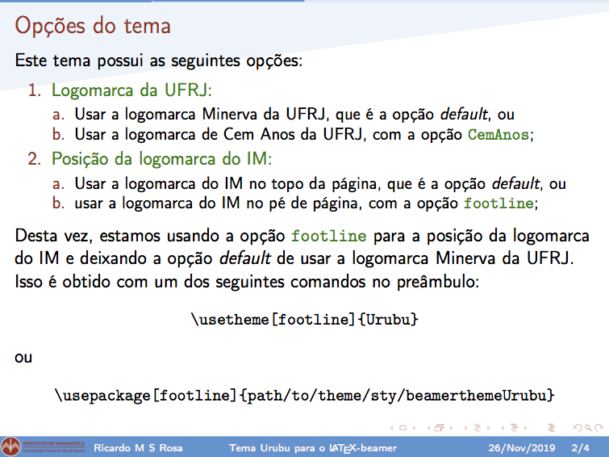

# $\LaTeX$-*beamertheme* Urubu


Este é o repositório do tema extra-oficial **Urubu** de apresentações em $\LaTeX$-*beamer* para a comunidade do [Instituto de Matemática](http://www.im.ufrj.br) da [Universidade Federal do Rio de Janeiro](https://ufrj.br).

*This is an unofficial $\LaTeX$ beamer presentation theme for members of the [Institute of Mathematics](http://www.im.ufrj.br/index.php/en/) of the [Universidade Federal do Rio de Janeiro](http://www.im.ufrj.br).*

*Copyright © 2019 [Ricardo M. S. Rosa](http://www.im.ufrj.br/rrosa) - rrosa@im.ufrj.br*


## Instalação

Abaixo, diferentes modos de instalação do tema.

### Em um subdiretório do TEXMFHOME

Esta instalação é a recomendada e permite que o tema seja acessível a partir de qualquer diretório do usuário.

Para essa instalação, procure onde o diretório TEXMFHOME reside e copie o subdiretório `theme` do pacote para um subdiretório do TEXMFHOME com o nome `beamerthemeUrubu`, por exemplo

```bash
TEXMFHOME/tex/latex/commonstuff/beamerthemeUrubu/theme
```

Mais precisamente

1. Encontre o caminho para o diretório TEXMFHOME. Um lugar típico é `~/Library/texmf`, mas pode estar em outro lugar. Pode-se achar esse diretório através da seguinte linha de comando em bash:

    ```bash
    kpsewhich -var-value=TEXMFHOME
    ```

1. Pode acontecer da variável TEXMFHOME apontar para um diretório que não exista ainda. Nesse caso, é necessário criar o diretório. Por exemplo, se TEXMFHOME aponta para `~/Library/texmf` mas esse diretório não existe, simplesmente crie esse diretório com

    ```bash
    cd ~/Library
    mkdir texmf
    ```

1. Uma vez que o diretório TEXMFHOME exista, crie o subdiretório para o tema:

    ```bash
    cd $(kpsewhich -var-value=TEXMFHOME)
    mkdir tex/latex/commonstuff/beamerthemeUrubu/
    ```

1. Em seguida, copie o subdiretório `theme` para o diretório recém-criado.

**Observação:** Tudo isso pode ser feito de uma vez só, independentemente do diretório `TEXMFHOME` já existir ou não, com os comandos:

```bash
mkdir $(kpsewhich -var-value=TEXMFHOME)/tex/latex/commonstuff/beamerthemeUrubu/
cp -r path/to/theme $(kpsewhich -var-value=TEXMFHOME)/tex/latex/commonstuff/beamerthemeUrubu/
```

onde `path/to/theme` é o caminho para o subdiretório `theme`, conforme baixado para a sua máquina.

### Em um subdiretório do diretório da apresentação

Alternativamente, pode-se copiar o subdiretório `theme` para o diretório que contenha a sua apresentação. Dessa forma, ele estará disponível exclusivamente para essa apresentação.

## Carregando o tema no *beamer*

1. Caso a instalação tenha sido feita em um subdiretório do TEXMFHOME, basta usar o comando

    ```latex
    \usetheme{Urubu}
    ```

1. Caso a instalação tenha sido feita no diretório da apresentação, então deve-se carregar o pacote com o comando

    ```latex
    \usepackage{theme/sty/beamerthemeUrubu}
    ```

## Opções do tema

Este tema tem as seguintes opções:

1. **Tipo de logomarca da UFRJ na página inicial:**

    a) Usar a logomarca Minerva da UFRJ, que é a opção *default;* ou

    b) Usar a logomarca de Cem Anos da UFRJ, com a opção `CemAnos`.

2. **Posição da logomarca do IM nos slides:**

    a) Usar a logomarca do IM no topo da página, que é a opção *default*; ou

    b) Usar a logomarca do IM no rodapé, com a opção `footline`.

Para usar uma ou mais opções não-*default* do tema, use, dependendo to tipo de instalação,

```latex
\usetheme[CemAnos, footline]{Urubu}
```

ou

```latex
\usepackage[CemAnos, footline]{theme/sty/beamerthemeUrubu}
```

## Campo extra na página-título

Um comando importante no $\LaTeX$ e, em particular, no *beamer*, é o `\titlepage`, que monta uma página-título, com várias informações. No caso do *beamer*, temos comandos específicos para os seguintes campos: **título** da apresentação, **subtítulo**, **nome** e **instituição** do(s) autor(es), e **data**. Além disso o *beamer* possui uma opção para a inclusão de uma **imagem** ao final desses informações e um comando extra para incluir **informações extras** antes ou depois desse conjunto de informações.

No tema *Urubu*, há um campo extra, para **informações a serem incluídas entre a instituição e a data**. Essas novas informações devem ser incluídas com o comando `\info{}`.

Vale, ainda, ressaltar que, neste tema *Urubu*, os logos do IM e da UFRJ são automaticamente exibidos na parte de baixo da página-título, após as informações acima.

## Mais informações

Mais informações sobre o tema podem ser lidas nas duas apresentações de exemplo incluídas nesse pacote: [Apresentação 1](apresentacoes/apresentacao1.pdf) e [Apresentação 2](apresentacoes/apresentacao2.pdf)

## Screenshots

**Página inicial da Apresentação 1:**



**Página quatro da Apresentação 1:**



**Página dez da Apresentação 1:**



**Página inicial da Apresentação 2:**



**Página dois da Apresentação 2:**



## Utilização do $\LaTeX$-beamer

Para mais informações sobre como usar o $\LaTeX$-*beamer* para montar as suas apresentações, veja, por exemplo, o tutorial que se inicia em [Beamer Presentations: A Tutorial for Beginners (Part 1)—Getting Started](https://www.overleaf.com/learn/latex/Beamer_Presentations:_A_Tutorial_for_Beginners_(Part_1)—Getting_Started.)

## Licenças

As **logomarcas** da [UFRJ](https://ufrj.br) ("Minerva" e "Cem Anos") são de uso exclusivo da comunidade da [UFRJ](https://ufrj.br), a menos que um consentimento explícito seja obtido. Mais informações nas páginas [Minervas da UFRJ](https://ufrj.br/minervas) e [A UFRJ Faz 100 Anos - Logomarca](https://ufrj.br/ufrjfaz100anoslogomarca).

A **logomarca** do [IM](http://www.im.ufrj.br) foi obtida da página do [Instituto de Matemática](http://www.im.ufrj.br) da [UFRJ](https://ufrj.br) e é para uso de membros do Instituto.

Os **códigos latex** contidos neste repositório estão disponíveis sob a licença [$\LaTeX$ Project Public License, Version 1.3c (LPPL-1.3c)](https://opensource.org/licenses/LPPL-1.3c), exceto pelas imagens das logomarcas, que possuem as restrições mencionadas acima.

Os **exemplos em pdf** estão sob a licença [Creative Commons Attribution 4.0 International license (CC BY 4.0)](https://creativecommons.org/licenses/by/4.0/).

Os arquivos de **documentação** estão disponíveis sob a licença [WTFPL](http://www.wtfpl.net/), exceto, novamente, pelas os arquivos de imagens associados.

Mais detalhes sobre as licenças no arquivo [LICENSES.md](LICENSES.md) e nos arquivos `*.sty` e `*.tex`.

## License for this `README.md` file

Copyright © 2019 [Ricardo M. S. Rosa](http://www.im.ufrj.br/rrosa) - <rrosa@im.ufrj.br>

This file `README.md` is free. It comes without any warranty, to the extent permitted by applicable law.

You can redistribute it and/or modify it under the terms of the [Do What The Fuck You Want To Public License, Version 2 (WTFPL version 2)](http://www.wtfpl.net/), as published by Sam Hocevar, except, however, for the images in the folder `readme_img`, which are loaded by this file and are not free (see the restrictions in [LICENSES.md](LICENSES.md)). Hence, `README.md` can be redistributed and/or modified either without the companion images or with different images as appropriately licensed.
